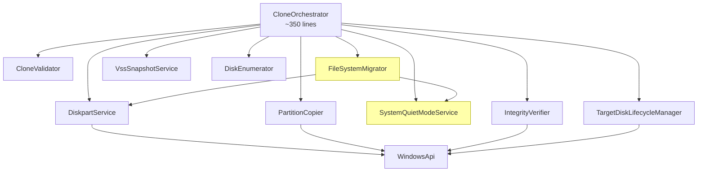

# DiskClonerEngine Breakup — Implementation Plan (v3)

> Updated 2026-03-06 against commit `f7660df` (3,978 lines, 92 methods)

## Problem

[DiskClonerEngine.cs](file:///Users/pisarz/Documents/projekty/test-diskcloning/DiskCloner.Core/Services/DiskClonerEngine.cs) has grown to **3,978 lines** with **92 methods** spanning 8 unrelated responsibilities. It has nearly quadrupled since the first review. This is unmaintainable.

## Goal

Break it into **8 focused services** + 1 thin orchestrator, each with a clear interface. Also fix satellite issues: inner classes, `FormatBytes` duplication, `DetermineBusType` duplication, and missing solution references.

---

## Architecture



Yellow = **new since v2 plan**

---

## All 92 Methods → 9 Classes

### 1. `CloneValidator` — Validation & Layout (~120 lines)

**File:** `DiskCloner.Core/Services/CloneValidator.cs`

| Method | Lines | Notes |
|---|---|---|
| `ValidateOperationAsync` | 434–524 | |
| `CalculateTargetLayout` | 556–624 | |
| `CalculateMaximumSystemPartitionBytes` | 626–648 | |

```csharp
public interface ICloneValidator
{
    Task ValidateAsync(CloneOperation operation, CloneProgress progress);
    void CalculateTargetLayout(CloneOperation operation);
}
```

---

### 2. `DiskpartService` — Diskpart Scripting & Partition Queries (~650 lines)

**File:** `DiskCloner.Core/Services/DiskpartService.cs`

| Method | Lines | Notes |
|---|---|---|
| `PrepareTargetDiskAsync` | 526–554 | |
| `ClearTargetDiskAsync` | 663–707 | |
| `CreatePartitionTableAsync` | 709–724 | |
| `CreatePartitionsViaDiskpartAsync` | 726–835 | |
| `GetDiskPartSizeMegabytes` | 837–845 | |
| `QueryTargetPartitionLayoutAsync` | 847–855 | Strategy: PS → WMI |
| `QueryTargetPartitionLayoutViaPowerShellAsync` | 857–907 | |
| `QueryTargetPartitionLayoutViaWmiAsync` | 909–954 | |
| `ParseTargetPartitionLayoutJson` | 956–994 | |
| `TryReadInt32Json` | 996–1009 | |
| `TryReadInt64Json` | 1011–1024 | |
| `ApplyTargetPartitionOffsets` | 1026–1103 | |
| `ParsePartitionTableFromDiskPartOutput` | 1105–1173 | Unit-testable |
| `GetExpectedDiskPartType` | 1175–1185 | Unit-testable |
| `NormalizeDiskPartType` | 1187–1202 | Unit-testable |
| `ParseSizeToBytes` / `TryParseSizeToBytes` | 1204–1247 | Unit-testable |
| `GetRequiredTargetStartingOffset` | 1249–1259 | |
| `AssertDiskpartScriptTargetsOnlyTargetDisk` | 2150–2165 | Safety guard |
| `OfflineTargetDiskAsync` | 3433–3480 | |
| `OnlineTargetDiskAsync` | 3482–3538 | |

```csharp
public interface IDiskpartService
{
    Task PrepareTargetDiskAsync(CloneOperation operation, CloneProgress progress);
    Task OfflineTargetDiskAsync(CloneOperation operation);
    Task OnlineTargetDiskAsync(CloneOperation operation);
    long GetRequiredTargetStartingOffset(PartitionInfo partition);
}
```

> [!TIP]
> All `Parse*`, `Normalize*`, `TryParse*` methods should be `public static` or `internal static` for unit testing.

---

### 3. `PartitionCopier` — Raw Disk I/O (~750 lines)

**File:** `DiskCloner.Core/Services/PartitionCopier.cs`

| Method | Lines | Notes |
|---|---|---|
| `CopyPartitionAsync` | 1280–1458 | Sector-aligned raw copy |
| `CopyPartitionSmartAsync` | 1461–1931 | NTFS bitmap-aware |
| `TryGetVolumeBitmapUnmanaged` | 1933–1970 | `FSCTL_GET_VOLUME_BITMAP` |
| `GetCopyStrategy` | 1973–1991 | Raw vs smart decision |
| `GetRawCopyLengthBytes` | 1993–2000 | |
| `FallbackToRawCopyOrThrowAsync` | 1261–1278 | |
| `EnsureTargetDiskMutationAllowed` | 2124–2137 | Safety guard |
| `EnsureTargetVolumeMutationAllowed` | 2139–2148 | Safety guard |

```csharp
public interface IPartitionCopier
{
    Task<long> CopyAsync(CloneOperation op, PartitionInfo partition,
        CloneProgress progress, long bytesCopiedSoFar);
}
```

---

### 4. `FileSystemMigrator` — Robocopy & Volume Management (~500 lines) 🆕

**File:** `DiskCloner.Core/Services/FileSystemMigrator.cs`

| Method | Lines | Notes |
|---|---|---|
| `ResolveSourceReadDescriptorAsync` | 2002–2047 | VSS path resolution |
| `CalculatePlannedTotalBytes` | 2049–2070 | |
| `GetEstimatedMigrationBytes` | 2072–2094 | |
| `GetSourceSystemDriveLetter` | 2096–2099 | |
| `NormalizeDriveLetter` | 2101–2104 | |
| `EnsureTrailingBackslash` | 2106–2111 | |
| `ToRobocopyPath` | 2113–2122 | |
| `RunProcessAsync` | 2167–2175 | Generic process runner |
| `MigratePartitionFileSystemAsync` | 2426–2481 | Orchestrates format+copy+validate |
| `GetMigrationSourceRootAsync` | 2483–2519 | |
| `FormatAndMountTargetPartitionAsync` | 2521–2559 | Diskpart format + assign |
| `MountExistingTargetPartitionAsync` | 2561–2598 | |
| `UnmountTargetPartitionAsync` | 2600–2634 | |
| `CopyWithRoboCopyAsync` | 2636–2836 | Robocopy with progress |
| `ValidateTargetVolumeAsync` | 2838–2866 | |
| `RebuildBootFilesAsync` | 2868–2890 | `bcdboot` invocation |
| `GetVolumeByDriveLetter` | 2892–2897 | |
| `GetVolumeUsedBytes` | 2899–2912 | |
| `CalculateSafeEta` | 2914–2931 | |
| `IsBenignRobocopyErrorZeroLine` | 2933–2941 | |
| `IsSuspiciousRobocopyStdoutLine` | 2943–2961 | |
| `GetAvailableDriveLetter` | 2404–2424 | |

```csharp
public interface IFileSystemMigrator
{
    Task MigratePartitionAsync(CloneOperation op, PartitionInfo partition,
        CloneProgress progress);
}
```

---

### 5. `SystemQuietModeService` — OneDrive & Service Management (~150 lines) 🆕

**File:** `DiskCloner.Core/Services/SystemQuietModeService.cs`

| Method | Lines | Notes |
|---|---|---|
| `EnterQuietModeAsync` | 2177–2248 | Stops OneDrive, services |
| `ExitQuietModeAsync` | 2250–2291 | Restarts them |
| `ResolveOneDriveExecutablePath` | 2293–2312 | |
| `QueryServiceStateCodeAsync` | 2314–2337 | `sc query` wrapper |
| `StopServiceBestEffortAsync` | 2339–2363 | |
| `StartServiceBestEffortAsync` | 2365–2387 | |
| `WaitForServiceStateAsync` | 2389–2402 | |

```csharp
public interface ISystemQuietModeService
{
    Task<QuietModeState> EnterAsync();
    Task ExitAsync(QuietModeState state);
}
```

---

### 6. `IntegrityVerifier` — Hash Verification (~330 lines)

**File:** `DiskCloner.Core/Services/IntegrityVerifier.cs`

| Method | Lines | Notes |
|---|---|---|
| `VerifyIntegrityAsync` | 2963–2974 | Strategy selector |
| `BuildVerificationExclusions` | 2976–3001 | |
| `FullHashVerificationAsync` | 3003–3145 | SHA-256 full |
| `SampleHashVerificationAsync` | 3147–3226 | Sampling |
| `ComputeHashAsync` | 3228–3279 | |
| `GetVerificationLengthBytes` | 3281–3288 | |

```csharp
public interface IIntegrityVerifier
{
    Task<bool> VerifyAsync(CloneOperation operation, CloneProgress progress);
}
```

---

### 7. `TargetDiskLifecycleManager` — Boot, Expand, Repair (~500 lines)

**File:** `DiskCloner.Core/Services/TargetDiskLifecycleManager.cs`

| Method | Lines | Notes |
|---|---|---|
| `ExpandPartitionAsync` | 3290–3363 | |
| `MakeBootableAsync` | 3365–3396 | |
| `RefreshDiskLayoutAsync` | 3398–3431 | |
| `UpdateBootConfigurationAsync` | 3540–3603 | BCD via `bcdboot` |
| `ValidateMountedWindowsPartitionAsync` | 3605–3620 | |
| `ExpandMountedNtfsFileSystemAsync` | 3622–3655 | |
| `RepairMountedWindowsVolumeAsync` | 3657–3732 | `chkdsk /f` |
| `IsVolumeDirtyAsync` | 3734–3754 | `fsutil dirty query` |
| `ValidateEfiBootArtifacts` | 3756–3771 | |
| `MarkTargetIncompleteAsync` | 3773–3814 | |
| `BuildNextSteps` | 3816–3844 | |
| `AppendHealthChecksSummary` | 3846–3875 | |

```csharp
public interface ITargetDiskLifecycleManager
{
    Task ExpandPartitionAsync(CloneOperation operation, CloneProgress progress);
    Task<bool> MakeBootableAsync(CloneOperation operation);
    Task MarkTargetIncompleteAsync(CloneOperation operation);
    List<string> BuildNextSteps(CloneResult result, CloneOperation operation);
}
```

---

### 8. `CloneOrchestrator` — Thin Coordinator (~350 lines)

**File:** `DiskCloner.Core/Services/CloneOrchestrator.cs`

Replaces `DiskClonerEngine`. Contains **only** workflow + progress:

| Method | Lines | Notes |
|---|---|---|
| `CloneAsync` | 90–432 | Main pipeline |
| `Cancel` | 3877–3884 | |
| `ReportProgress` | 3886–3892 | |
| `GetOperationSummary` | 3894–3948 | |
| `EstimateOperationTime` | 3950–3978 | |

```csharp
public CloneOrchestrator(
    ILogger logger,
    ICloneValidator validator,
    IDiskpartService diskpartService,
    IPartitionCopier copier,
    IFileSystemMigrator migrator,
    ISystemQuietModeService quietMode,
    IIntegrityVerifier verifier,
    ITargetDiskLifecycleManager lifecycle,
    DiskEnumerator diskEnumerator,
    VssSnapshotService vssService)
```

---

## Additional Fixes (Same PR)

### A. Extract Inner Classes to `Models/`

Move from `DiskClonerEngine` to standalone files:

| Class | Engine Lines | New File |
|---|---|---|
| `BootFinalizationStatus` | 49–56 | `Models/BootFinalizationStatus.cs` |
| `VolumeRepairStatus` | 58–65 | `Models/VolumeRepairStatus.cs` |
| `SourceReadDescriptor` | 67–72 | `Models/SourceReadDescriptor.cs` |
| `QuietModeState` | 74–79 | `Models/QuietModeState.cs` |

### B. Extract `ByteFormatter` Utility

Replace **5 copies** of `FormatBytes` across `DiskInfo`, `PartitionInfo`, `CloneProgress`, `DiskClonerEngine`, `MainWindow.xaml.cs`.

**File:** `DiskCloner.Core/Utilities/ByteFormatter.cs`

### C. Consolidate `DetermineBusType` in `DiskEnumerator`

Remove the duplicate at line 603 and call the primary method at line 188.

### D. Add `DiskCloner.UnitTests` to `.sln`

### E. Move `TestHelpers.cs` from `DiskCloner.Core/Utilities` to `DiskCloner.UnitTests`

### F. Delete or move `wmi_test.cs` from repo root

---

## Migration Order

| Step | Action | Risk | Commit |
|---|---|---|---|
| 1 | Extract inner classes to `Models/` | None | `refactor: extract inner DTO classes` |
| 2 | Extract `ByteFormatter`, replace all 5 copies | None | `refactor: deduplicate FormatBytes` |
| 3 | Consolidate `DetermineBusType` in `DiskEnumerator` | Low | `refactor: consolidate bus type` |
| 4 | Add `DiskCloner.UnitTests` to `.sln`, move `TestHelpers` | None | `chore: fix solution references` |
| 5 | Extract `IntegrityVerifier` + interface | Low | `refactor: extract IntegrityVerifier` |
| 6 | Extract `SystemQuietModeService` + interface | Low | `refactor: extract quiet mode` |
| 7 | Extract `DiskpartService` + interface | Medium | `refactor: extract DiskpartService` |
| 8 | Extract `CloneValidator` + interface | Low | `refactor: extract validator` |
| 9 | Extract `PartitionCopier` + interface | Medium | `refactor: extract copier` |
| 10 | Extract `FileSystemMigrator` + interface | Medium | `refactor: extract migrator` |
| 11 | Extract `TargetDiskLifecycleManager` + interface | Low | `refactor: extract lifecycle` |
| 12 | Rename remaining → `CloneOrchestrator`, update UI | Low | `refactor: create orchestrator` |

> [!IMPORTANT]
> Each step = separate commit. After each, run `dotnet build` to confirm compilation.

---

## New File Summary

| Path | Status | ~Lines |
|---|---|---|
| `Models/BootFinalizationStatus.cs` | [NEW] | 15 |
| `Models/VolumeRepairStatus.cs` | [NEW] | 15 |
| `Models/SourceReadDescriptor.cs` | [NEW] | 15 |
| `Models/QuietModeState.cs` | [NEW] | 15 |
| `Utilities/ByteFormatter.cs` | [NEW] | 20 |
| `Services/ICloneValidator.cs` | [NEW] | 15 |
| `Services/CloneValidator.cs` | [NEW] | 120 |
| `Services/IDiskpartService.cs` | [NEW] | 20 |
| `Services/DiskpartService.cs` | [NEW] | 650 |
| `Services/IPartitionCopier.cs` | [NEW] | 15 |
| `Services/PartitionCopier.cs` | [NEW] | 750 |
| `Services/IFileSystemMigrator.cs` | [NEW] | 15 |
| `Services/FileSystemMigrator.cs` | [NEW] | 500 |
| `Services/ISystemQuietModeService.cs` | [NEW] | 10 |
| `Services/SystemQuietModeService.cs` | [NEW] | 150 |
| `Services/IIntegrityVerifier.cs` | [NEW] | 10 |
| `Services/IntegrityVerifier.cs` | [NEW] | 330 |
| `Services/ITargetDiskLifecycleManager.cs` | [NEW] | 20 |
| `Services/TargetDiskLifecycleManager.cs` | [NEW] | 500 |
| `Services/CloneOrchestrator.cs` | [NEW] | 350 |
| `Services/DiskClonerEngine.cs` | [DELETE] | — |

---

## Verification Plan

### Build
```bash
dotnet build DiskCloner.sln --configuration Debug
```

### Tests
```bash
dotnet test DiskCloner.UnitTests/DiskCloner.UnitTests.csproj --verbosity normal
```

### New Tests to Add

| Test Class | Key Tests | Target |
|---|---|---|
| `ByteFormatterTests` | 0, KB, MB, GB, TB, PB, negatives | `ByteFormatter` |
| `DiskpartParsingTests` | Valid output, locale variants, empty, edge sizes | `DiskpartService` |
| `CloneValidatorTests` | Null source, same disk, too small, missing EFI | `CloneValidator` |
| `RobocopyParsingTests` | Benign errors, suspicious lines, exit codes | `FileSystemMigrator` |
| `QuietModeTests` | OneDrive path resolution, service state parsing | `SystemQuietModeService` |

### Manual Smoke Test (Windows)
1. Launch as Admin → disks enumerate
2. Preview tab → summary renders correctly
3. (Optional) Clone to USB test drive

---

## Out of Scope

- MVVM / DI container (unblocked by interfaces from this plan)
- Replace custom `ILogger` with `Microsoft.Extensions.Logging`
- Replace `event Action<T>` with `IProgress<T>`
- CI/CD pipeline
- `.editorconfig` / analyzers
- Code signing for `publish-release.ps1`
